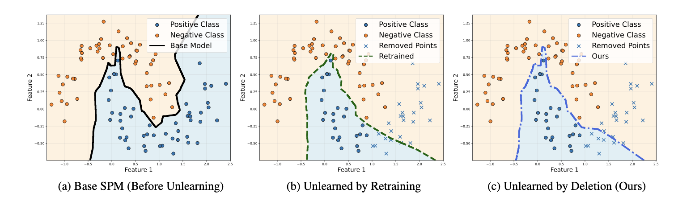

# Designing to Forget: Deep Semi-parametric Models for Unlearning

**CVPR 2026**

[Amber Yijia Zheng](https://amberyzheng.github.io/)\*, [Yu-Shan Tai]()\*, [Raymond A. Yeh](https://raymond-yeh.com/)

Department of Computer Science, Purdue University


<!-- [[Paper]](https://arxiv.org/abs/XXXX.XXXXX) -->

<p align="center">
  
</p>

**TL;DR:** We introduce deep semi-parametric models (SPMs) that enable exact machine unlearning by simply deleting training samples at test time — no retraining or parameter updates required.

<details>
<summary><b>Abstract</b></summary>

Recent advances in machine unlearning have focused on developing algorithms to remove specific training samples from a trained model. In contrast, we observe that not all models are equally easy to unlearn. Hence, we introduce a family of deep semi-parametric models (SPMs) that exhibit non-parametric behavior during unlearning. SPMs use a fusion module that aggregates information from each training sample, enabling explicit test-time deletion of selected samples without altering model parameters. Empirically, we demonstrate that SPMs achieve competitive task performance to parametric models in image classification and generation, while being significantly more efficient for unlearning. Notably, on ImageNet classification, SPMs reduce the prediction gap relative to a retrained (oracle) baseline by 11% and achieve over 10x faster unlearning compared to existing approaches on parametric models.
</details>

---

## Setup

### 1. Environment
We recommend using Conda to manage your environment:
```bash
conda create -n spm python=3.10 -y
conda activate spm

# Install dependencies
pip install -r requirements.txt
conda install pytorch::faiss-gpu
```

### 2. ImageNet Data Preparation
1. **Download:** Get the dataset from the [Kaggle ImageNet Challenge](https://www.kaggle.com/competitions/imagenet-object-localization-challenge/data).
2. **Preprocess:** Use the [REPA preprocessing script](https://github.com/sihyun-yu/REPA/tree/main/preprocessing) to structure the data correctly.

---

## Pretraining SPM Models

Train a standard SPM model for the target task.

### Image Classification
```bash
# CIFAR-10
bash scripts/classification/run_cls_cifar.sh $GPU_ID

# ImageNet
bash scripts/classification/run_cls_imagenet.sh $GPU_ID
```

### Image Generation (DDPM)
```bash
# CIFAR-10
bash scripts/generation/run_ddpm.sh $GPU_ID
```

---

## SPM Unlearning: Classification

> **Note:** For all evaluation scripts, ensure you modify `--ckpt_path` in the `.sh` file to point to your pretrained SPM checkpoint.

### Class-wise Unlearning
Unlearn specific classes (1 or 5) and automatically generate the retrained baseline.
```bash
# CIFAR-10 ($NUM_CLASS_UNLEARN: 1 or 5)
bash scripts/eval/eval_cls_cifar.sh $GPU_ID $NUM_CLASS_UNLEARN

# ImageNet
# Modify --datadir inside the script to your IMAGENET_DATA_PATH
bash scripts/eval/eval_cls_imagenet.sh $GPU_ID
```

### Random Unlearning
For reproducibility, generate and save the random indices first:
```bash
# Example: Generate indices for a specific ratio
python random_unlearn_index_generate.py --ratio 0.5 --outpath random_unlearn_idx/
```
Then, execute the unlearning:
```bash
# $RATIO: e.g., 0.1 or 0.5
bash scripts/eval/eval_cls_cifar_rand.sh $GPU_ID $RATIO
```

---

## SPM Unlearning: Image Generation

### 1. Train Retrained Baselines
Retrained SPMs for unlearning evaluation.
```bash
bash scripts/generation/run_ddpm_retrain.sh $GPU_ID
```

### 2. Execute Unlearning (Sample + UA + FIR_R)
Run the unlearning process for DDPM. Update the `--ckpt_path` to your pretrained or retrained model.
```bash
bash scripts/eval/eval_ddpm.sh $GPU_ID
```

### 3. Evaluation: FID_O
Calculate the **FID_O** metric proposed in our paper to compare the distribution of the unlearned model against the retrained model.
```bash
# Pass the paths to your retrained (real) and unlearned (fake) image folders
bash scripts/eval/eval_ddpm_fid_diff.sh --real_path $RETRAIN_IMG_PATH --fake_path $UNLEARN_IMG_PATH --out_path ./results/fid/
```

---

## Project Structure

```
.
├── main.py                         # Training entry point
├── main_retrain.py                 # Retrain baseline entry point (excludes specified classes)
├── evaluate.py                     # Evaluation entry point (unlearning metrics + generation)
├── fid_diff.py                     # FID_O metric computation
├── random_unlearn_index_generate.py
├── config/                         # YAML configs for classification and generation
├── dataset/                        # PyTorch Lightning DataModules (CIFAR-10, ImageNet)
├── models/
│   ├── spm_classifier.py           # Semi-parametric classifier (MoE + PairwiseRelationExpert)
│   └── spm_ddpm.py                 # Semi-parametric DDPM
├── nets/
│   ├── resnet.py                   # ResNet encoder for CIFAR-scale images
│   ├── unet_spm.py                 # SPM-augmented UNet with SemiParametricMiddleBlock
│   └── ddpm_cond.py                # DDPM with support conditioning (DDIM sampling + CFG)
├── evaluation/
│   ├── comp_classification_metrics.py  # Unlearning metrics (UA, RA, MIA)
│   ├── fid_diffusion.py            # Sample generation + FID computation
│   └── cls_acc_edm.py              # Classification accuracy on generated images
├── utils/                          # Config loading, dataset utilities, logging
└── scripts/                        # Shell scripts for training and evaluation
```

---

## Citation

If you find this work useful, please cite:

```bibtex
@inproceedings{zheng2026designing,
  title={Designing to Forget: Deep Semi-parametric Models for Unlearning},
  author={Zheng, Amber Yijia and Tai, Yu-Shan and Yeh, Raymond A.},
  booktitle={Proceedings of the IEEE/CVF Conference on Computer Vision and Pattern Recognition (CVPR)},
  year={2026}
}
```
